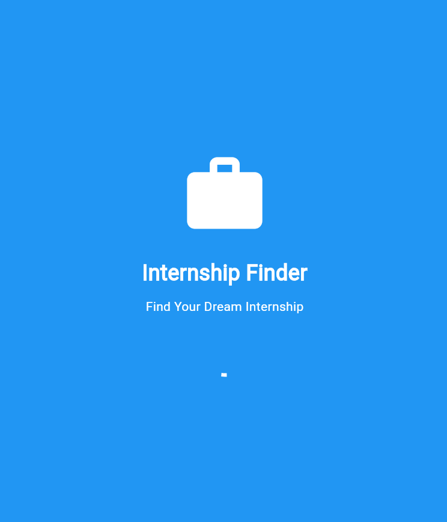
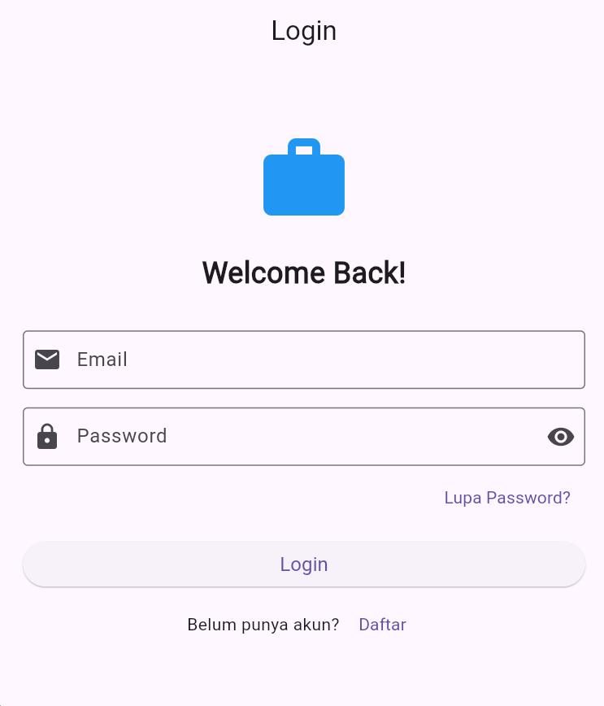
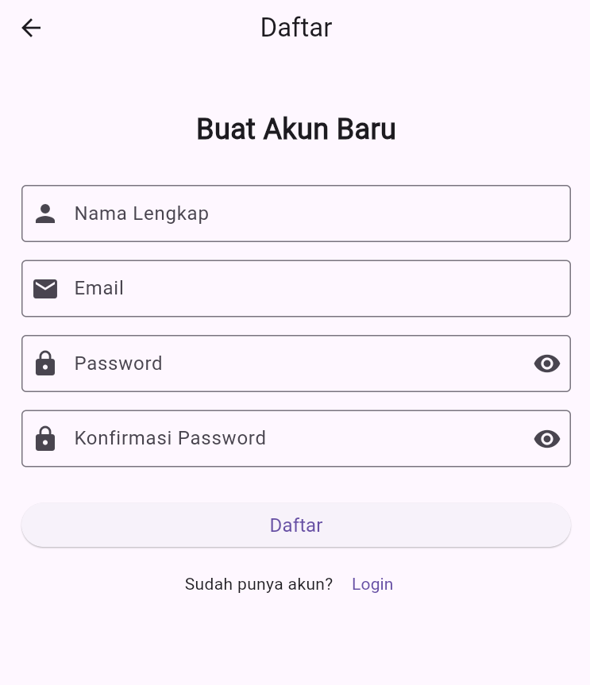
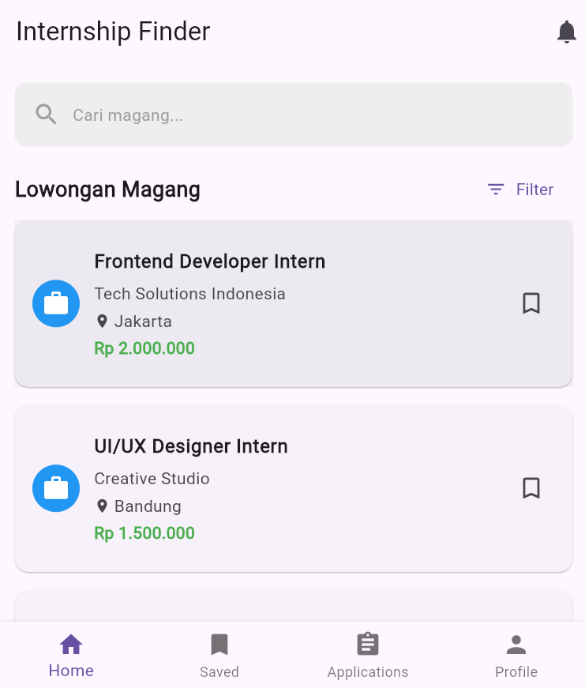
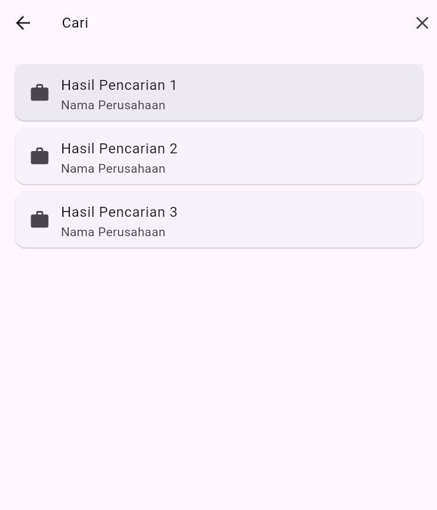
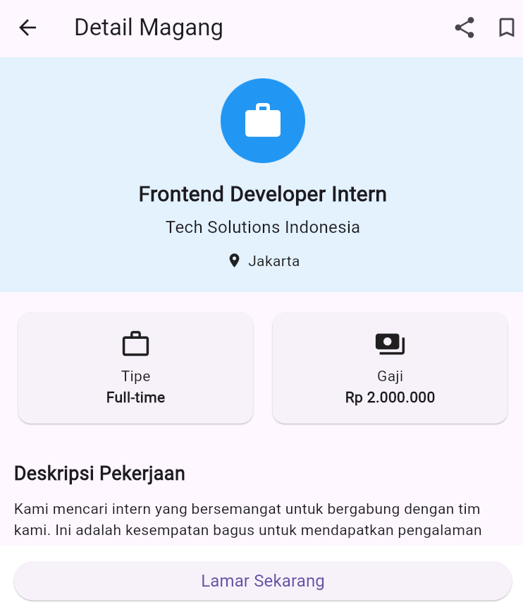
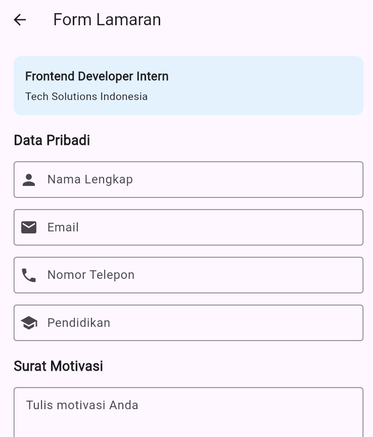
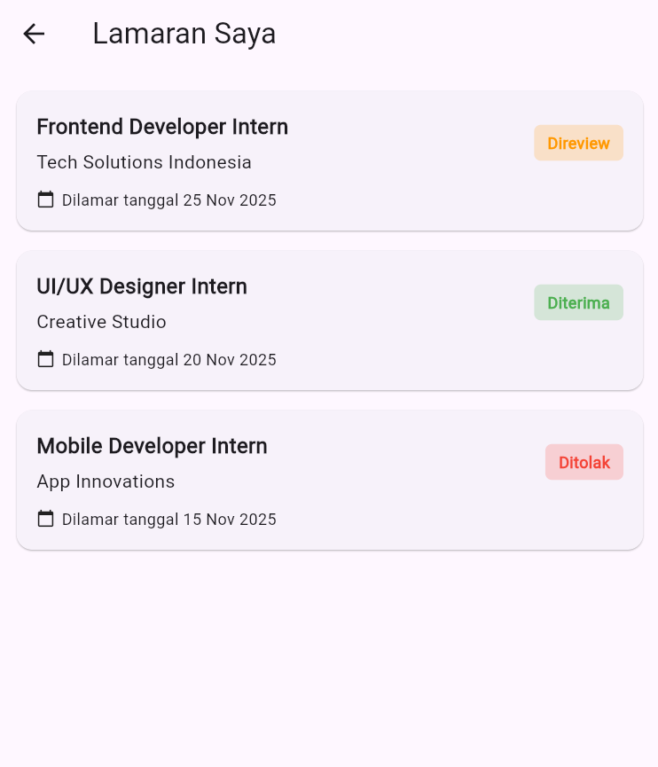
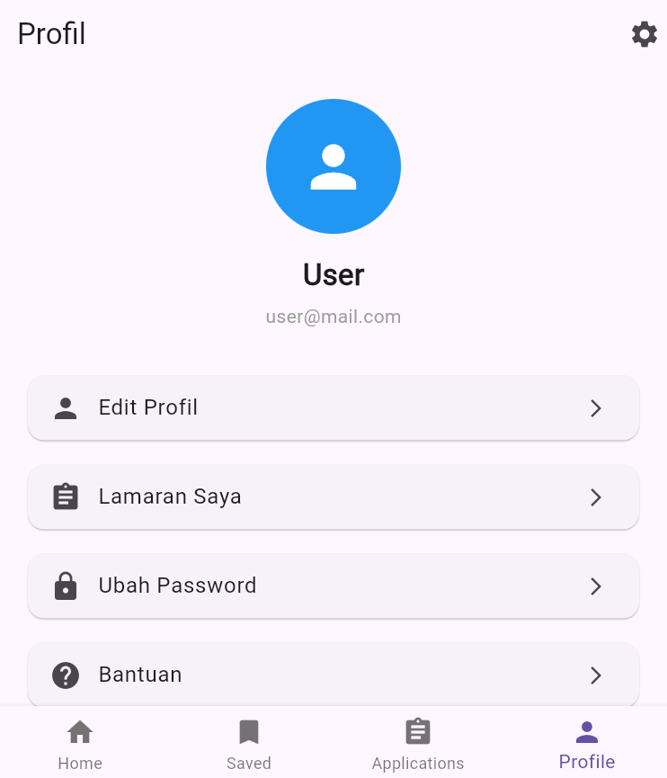
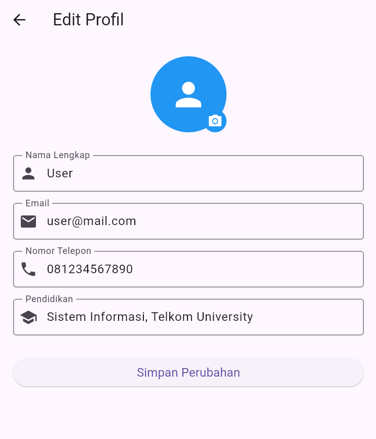

# Internship Finder - Mobile App

Aplikasi mobile untuk mencari dan melamar lowongan magang dengan mudah dan cepat.

**Mata Kuliah:** Dasar Pemrograman Perangkat Bergerak (DPPB)  
**Universitas:** Telkom University  
**Semester:** 3 / Tahun Akademik 2025/2026  
**Assessment:** Assessment 2 - Layout, Widget & Navigasi

---

## Team Members - Kelompok 1

| Nama | NIM | Kontribusi |
|------|-----|------------|
| **Hidayat Nurwahid** | 607012400045 | Authentication & Splash (3 screens, 4 alerts) |
| **Arsyad Defira Maulana** | 607012400094 | Home & Internship (4 screens, 4 alerts) |
| **M Dzikra Hafidz Fauzan** | 607012400050 | Profile & Application (4 screens, 5 alerts) |

---

## Features

### Authentication Module (Hidayat Nurwahid)
- **Splash Screen** - Auto navigation setelah 3 detik
- **Login Screen** - Form email & password dengan validasi
- **Register Screen** - Pendaftaran akun baru dengan validasi lengkap
- **Alerts:** Login error, Forgot password, Register validation, Success dialog

### Home & Internship Module (Arsyad Defira Maulana)
- **Main Screen** - Bottom Navigation Bar (4 tabs)
- **Home Screen** - List lowongan magang dengan Card layout
- **Search Screen** - Pencarian lowongan dengan filter
- **Detail Screen** - Informasi lengkap lowongan
- **Alerts:** Notification dialog, Filter bottom sheet, Bookmark & Filter snackbars

### Profile & Application Module (M Dzikra Hafidz Fauzan)
- **Application Form** - Form lamaran dengan validasi lengkap
- **Applications History** - Riwayat lamaran dengan status badge (Direview/Diterima/Ditolak)
- **Profile Screen** - Info user dengan menu navigasi
- **Edit Profile** - Update data pribadi
- **Alerts:** Submit confirmation, Success, Logout confirmation, Update success, Info dialogs

---

## Assessment 2 Requirements

| Requirement | Minimum | Implemented | Status |
|-------------|---------|-------------|--------|
| Screens per anggota | 3 | 3-4 per anggota (Total: 11) | Completed |
| Alert per anggota | 1 | 4-5 per anggota (Total: 13) | Completed |
| Widget & Layout | Required | Column, Row, Card, ListView, TextField, Button, dll | Completed |
| Navigasi | Required | push, pop, pushReplacement, pushAndRemoveUntil | Completed |

**Summary:** Semua requirement Assessment 2 terpenuhi dengan melebihi target minimum.

---

## Tech Stack

- **Framework:** Flutter 3.0+
- **Language:** Dart
- **UI:** Material Design
- **State Management:** setState
- **Navigation:** Navigator
- **Data:** Dummy data (List<Map<String, dynamic>>)

---

## Installation

```bash
# Clone repository
git clone https://github.com/kanelaura/kelompok1-internship-finder.git

# Install dependencies
cd kelompok1-internship-finder
flutter pub get

# Run application
flutter run
```

### Test Credentials
```
Email:    user@mail.com
Password: 123456
```

---

## Project Structure

```
lib/
├── main.dart              # File gabungan (semua module)
├── hidayat-auth.dart      # Module Authentication
├── arsyad-home.dart       # Module Home & Internship
└── dzikra-profile.dart    # Module Profile & Application

docs/
├── DOKUMENTASI_PROJECT.md
├── LAPORAN_PROGRESS.md
├── PANDUAN_GITHUB.md
└── screenshots/           # 11 screenshots
```

---

## Screenshots

### Authentication (Hidayat Nurwahid)

<table>
  <tr>
    <td align="center"><br><b>Splash Screen</b></td>
    <td align="center"><br><b>Login Screen</b></td>
    <td align="center"><br><b>Register Screen</b></td>
  </tr>
</table>

### Home & Internship (Arsyad Defira Maulana)

<table>
  <tr>
    <td align="center"><br><b>Main Screen</b></td>
    <td align="center"><br><b>Home Screen</b></td>
    <td align="center"><br><b>Search Screen</b></td>
  </tr>
  <tr>
    <td align="center"><br><b>Detail Screen</b></td>
    <td></td>
    <td></td>
  </tr>
</table>

### Profile & Application (M Dzikra Hafidz Fauzan)

<table>
  <tr>
    <td align="center"><br><b>Application Form</b></td>
    <td align="center"><br><b>Applications History</b></td>
    <td align="center"><br><b>Profile Screen</b></td>
  </tr>
  <tr>
    <td align="center"><br><b>Edit Profile</b></td>
    <td></td>
    <td></td>
  </tr>
</table>

---

## Development Timeline

| Date | Activities | Status |
|------|-----------|--------|
| 28 Nov - 4 Des | Setup & Planning | Completed |
| 5 Des - 10 Des | Development & Testing | Completed |
| 11 Des | **Presentasi Assessment 2** | Progress |

**Total Duration:** 14 hari (28 Nov - 11 Des 2025)  
**Status:** Akan melakukan presentasi Assessment 2 

---

## Documentation

Dokumentasi lengkap tersedia di folder [`docs/`](docs/):
- [DOKUMENTASI_PROJECT.md](docs/DOKUMENTASI_PROJECT.md) - Dokumentasi project
- [LAPORAN_PROGRESS.md](docs/LAPORAN_PROGRESS.md) - Progress pengerjaan
- [PANDUAN_GITHUB.md](docs/PANDUAN_GITHUB.md) - Panduan Git & GitHub

---

## Next Phase - Assessment 3

**Fokus:** Alert, ListView & HTTP  
**Planned Features:**
- API integration
- HTTP Methods (GET, POST, PUT/DELETE)
- Real data dari API
- ListView dengan data API

Timeline akan ditentukan setelah Assessment 2.

---

## Contact

| Anggota | Email | GitHub |
|---------|-------|--------|
| Hidayat Nurwahid | paslimkimochi@gmail.com | [@kanelaura](https://github.com/kanelaura) |
| Arsyad Defira Maulana | inback210@gmail.com | [@acaik](https://github.com/acaik) |
| M Dzikra Hafidz Fauzan | belum isi | [belum isi) |

---

**Dosen Pengampu:** Lukmanul Hakim Firdaus  
**Repository:** https://github.com/kanelaura/kelompok1-internship-finder  
**Version:** 1.0.0 (Assessment 2)  
**Last Updated:** Desember 2025

---

## License

Academic Project - Telkom University © 2025

